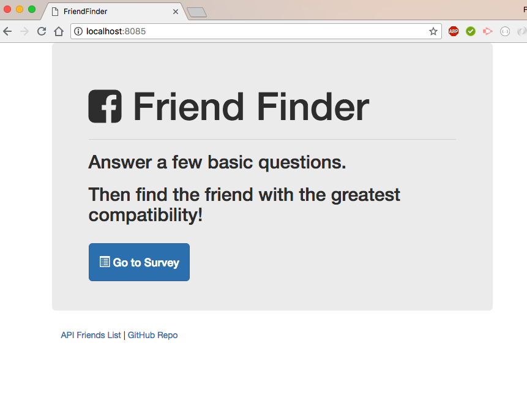
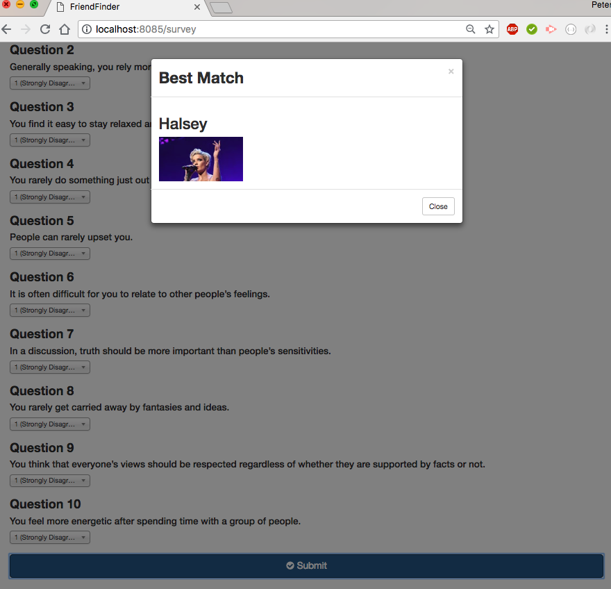

**FRIEND FINDER**
Friend Finder is a dating app.  It uses 
* node.express: a declaritive routing system. 
* node.body-parser: bodyParser object uses various factories to create middlewares that reads a form's input + stores it as javascript object accessible through req.body
* node.path: module provides utlitlies for working w/file + directory paths

How to use:
1. visit: https://stark-wildwood-59351.herokuapp.com/

2. enter the home page and and press the survey button
        -survey asks you 10 ?s and then matches with you with your best fit

3. Here are some screenshoots:

This Project in maintained by peter6468 and users can contact him to get help.